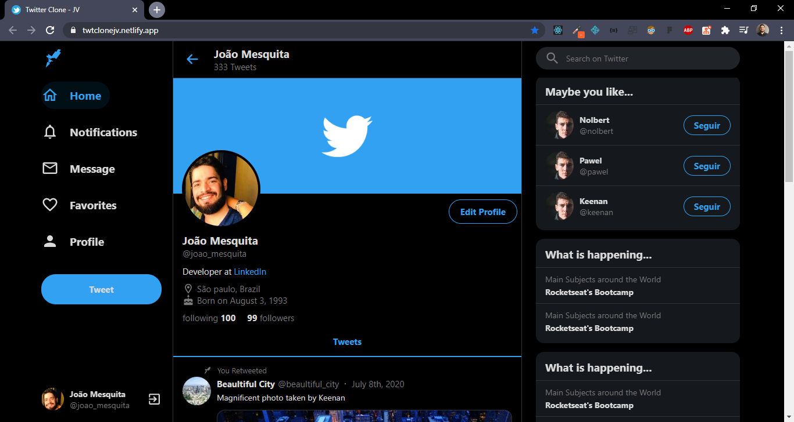
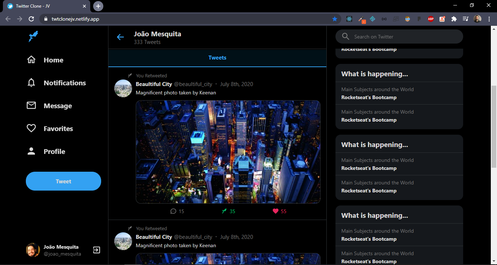
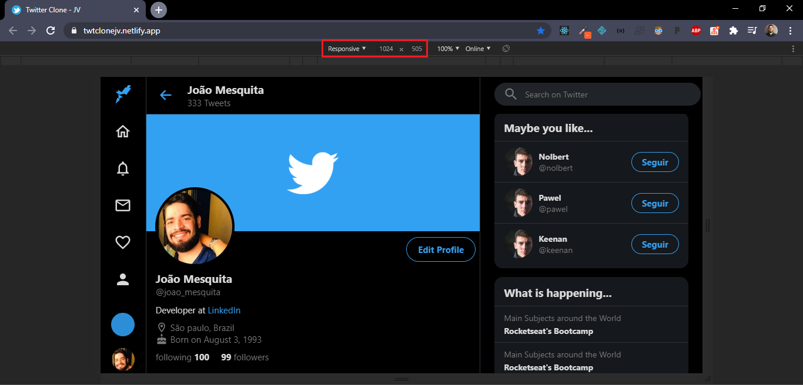
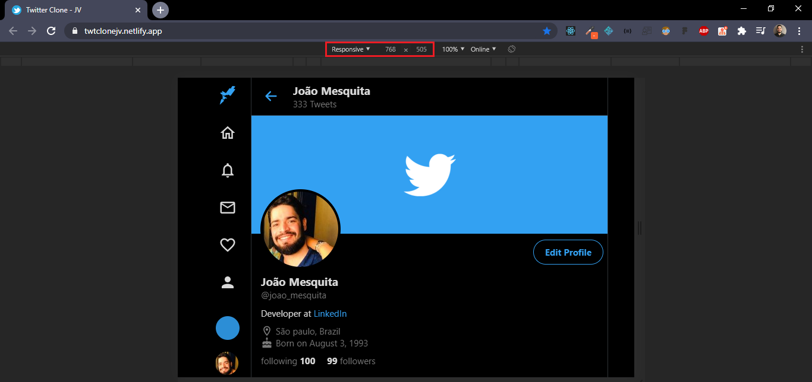
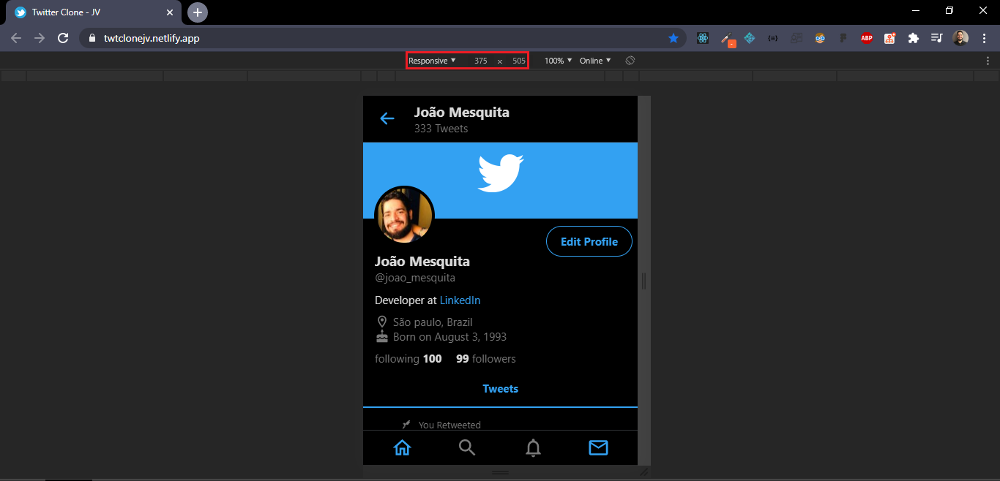

<h1 align="center">
  
</h1>

<h2 align="center">
  Twitter Home "Clone"
</h2>

## :computer: About

Twitter home UI Clone done following guidelines provided by [Rocketseat](https://www.youtube.com/watch?v=K-8z_4xvT3o&list=LLOxVF9ZzE0vgbS0wWZQk4Lw&index=3&t=0s)
company using ReactJS, TypeScript, a lot of CSS (styled-components) and it's responsive. </br> You can check the result [here](https://twtclonejv.netlify.app/).

## :wrench: Built with

<details><summary><b>Click to drop</b></summary>

- React (^16.13.1)
- Typescript (~3.7.2)
- Node (v12.16.1)
- Yarn (1.22.4)
- styled-components (^5.1.1)
- styled-icons (^10.6.0 & ^10.7.0)
- react-sticky-box (^0.9.3)

</details>

## :framed_picture: :computer: Screens

<h3 align="center">



<details><summary><b> :triangular_flag_on_post: More Screens :triangular_flag_on_post: </b></summary>





</details>
</h3>

## :small_red_triangle: How to install and run on your computer:

<strong>1. Clone this project and install dependencies</strong>

```
$ git clone https://github.com/jvictor-am/twitter-clone.git
$ cd twitter-clone
$ yarn install
or
$ npm install
```

<strong>2. Run on localhost:3000</strong>

```
$ yarn start
or
$ npm start
```

## :heavy_check_mark: Deploy:

<strong>Netlify:</strong> https://twtclonejv.netlify.app/

</br>

---

# Author

[**João Victor**](https://www.linkedin.com/in/jo%C3%A3o-victor-de-andrade-mesquita-848a09122/)

<h2 align="center">
  Thank You!
</h2>
